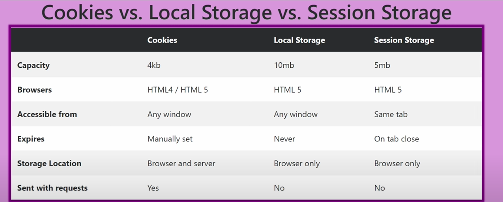

# Loom Recording Link:

Link:https://www.loom.com/share/77a7bec4c60a4455a7a93eaec5f7ba1c

# Homework: Answer Questions

### IP Address

Answer: Internet Protocol Address helps each computer find each other.

### Client vs Server Difference

Answer: Server is a special computer directly connect to the internet and responses the request from clients, but client not. Client connects to the internet by ISP (Internet Service Provider) and requests resources from server.

### What is CDN and why do we need it?

Answer: CDN(content delivery network) is designed for speeding up delivery of static HTML content globally.CDN can bring content closer to users by using hundreds of PoP (point of presence)to improve web service performance.
CDN has two benifits:

1.Security: offers robust DDoS protection by having a network with capacity much larger than the attackers 2. Availablity: increases the availability by having copies of content in many PoPs.

### Performance / Initial Load Time

Answer:
CDN can enhance the peformance of web services by decreasing initial load time for users.Placing servers around world, known as PoPs will reduce the distances data needs to travel.

### What are RESTful APIs?

REST stands for Representational State Transfer, managing create, read, update, and delete operations. RESTful APIs are APIs that follow the REST architectural style.

Answer:

### CRUD: GET, POST, DELETE, UPDATE

Answer:GET:Retrieves data from the server
POST: Submit data to the server
UPDATE:Update data already on the server
DELETE: Deletes data from the server

### What are some status codes? (200, 401, 403, 404)

Answer:
200:Ok, indicating the request was successful.
401:Unauthorized, indicating that authentication is required for access
403:Forbidden, indicating that the server understood the request but refuse to authorize it
404:Not found, indicating the server couldn't find the requested resource.

### What is semantic HTML? Give examples.

Answer: A semantic element describes its meaning to both browser and the developer.
Like header element, footer element and etc.

### Add meaning to tags: making it easier for developers and screen readers to understand.

Answer:

### What are local storage vs session storage vs cookies?

Answer:
**Cookies**:
Storage Capacity: Limited to about 4 kilobytes.
Compatibility: Compatible with older browsers (HTML 4), but also support HTML 5.
Availability: Accessible across all tabs and windows.
Expiration Control: Cookies have expiration settings that can be configured by the developer.
Transmission: Sent to the server with each request, which can affect performance if not managed properly.
**Local Storage**: Benefits and Usage
Capacity: Can store up to 10 megabytes.
Persistence: Data remains until explicitly deleted by the user or via script.
Scope: Available across all sessions and tabs until cleared.
**Session Storage**: Session-Specific Data
Capacity: Up to 5 megabytes.
Session-Limited: Data is cleared once the session or tab is closed.
Isolation: Data is not shared across tabs or windows even on the same site.

### What is accessibility and why is it important?

Answer:Accessibility refers to the design and creation of websites and tools that are usable by people with disabilities. Ignoring accessibility can lead to lawsuits, as demonstrated by real-world examples like the Domino's Pizza case
